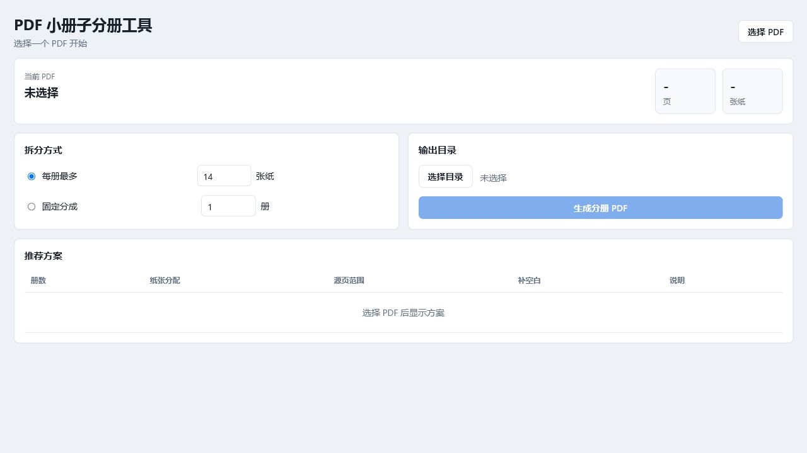

# Booklet Splitter

[中文说明](README.zh-CN.md)



Booklet Splitter is a desktop tool for splitting a reading-order PDF into
booklet-sized PDF parts. It is designed for PDFs that will later be printed as
double-sided booklets, folded, and bound in multiple thin volumes.

The first release is intentionally narrow. It focuses on one workflow:

1. Choose a PDF.
2. Choose a booklet splitting plan.
3. Generate several smaller booklet PDFs and a print manifest.

## Features

- Split one PDF by maximum sheets per booklet.
- Split one PDF by a fixed booklet count.
- Keep source pages in continuous ranges.
- Pad each booklet to a multiple of four pages.
- Generate booklet PDFs with predictable file names.
- Generate `打印清单.txt` and `manifest.txt`.
- Use a modern desktop UI built with pywebview.
- Provide a command line entry point for automation.

## What It Does Not Do Yet

- It does not convert EPUB or CBZ files.
- It does not detect color pages.
- It does not split black-and-white/color print jobs.
- It does not manage printer queues.
- It does not integrate SumatraPDF.
- It does not create true 2-up A4 imposition PDFs yet.

The input PDF is expected to already be in reading order. The generated booklet
PDFs are continuous source-page ranges padded to a four-page capacity. Actual
booklet layout and duplex settings are still handled by your printer driver or
another imposition tool.

## Splitting Rules

Each sheet represents four PDF page slots.

```text
total_sheets = ceil(total_pages / 4)
```

When splitting by maximum sheets per booklet, Booklet Splitter first calculates
how many booklets are needed, then balances sheets across booklets.

Example:

```text
160 pages -> 40 sheets
max 14 sheets per booklet -> 3 booklets
sheet distribution -> 14 / 13 / 13
```

When splitting by a fixed booklet count, it balances the total sheets across
that count.

Example:

```text
168 pages -> 42 sheets
fixed 4 booklets -> 11 / 11 / 10 / 10
```

The final booklet is padded with blank pages when its source range does not fill
the booklet capacity.

## Install For Development

```powershell
python -m venv .venv
.\.venv\Scripts\Activate.ps1
python -m pip install -e ".[dev]"
python -m pytest
```

## Run The App

After installing the project:

```powershell
booklet-splitter
```

If your shell cannot find installed scripts, use:

```powershell
python -m booklet_splitter
```

## Command Line

```powershell
booklet-split input.pdf --max-sheets 14
booklet-split input.pdf --booklet-count 3
booklet-split input.pdf --booklet-count 3 --output-dir output
```

Fallback form:

```powershell
python -m booklet_splitter.cli input.pdf --max-sheets 14
```

## Windows Build

Build the packaged desktop app with:

```powershell
.\scripts\build_windows.ps1
```

The script creates a clean `.venv-build` environment before running PyInstaller,
so the package does not accidentally include unrelated packages from Anaconda or
your global Python environment.

The distributable folder is:

```text
dist\BookletSplitter\
```

Run:

```text
dist\BookletSplitter\BookletSplitter.exe
```

## Examples

Generate the sample PDF with:

```powershell
python .\scripts\create_example_pdf.py
```

The default output is:

```text
examples\sample-17-pages.pdf
```

Try it with:

```powershell
booklet-split examples\sample-17-pages.pdf --booklet-count 2
```

## Release Zip

After building the Windows app, create a zip archive with:

```powershell
.\scripts\package_release.ps1
```

The release archive is written to:

```text
release\BookletSplitter-v0.1.0-windows-x64.zip
```

## Project Layout

```text
src/booklet_splitter/core/      PDF splitting logic and manifest generation
src/booklet_splitter/app/       pywebview desktop integration
src/booklet_splitter/frontend/  HTML/CSS/JS interface
tests/                          unit and smoke tests
scripts/                        development and build helpers
```

## Roadmap

- Add release screenshots.
- Add copyright-safe example PDFs.
- Add a zip release script.
- Add true 2-up booklet imposition.
- Reintroduce optional color-page workflows.

## License

MIT.
