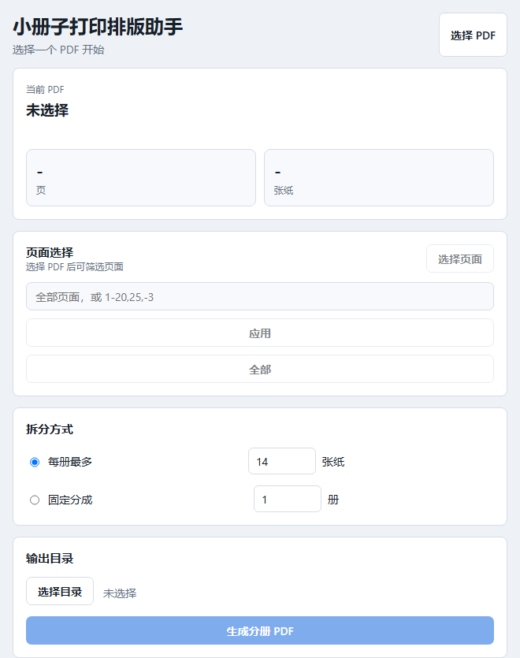

# 小册子打印排版助手 / Booklet Print Layout Assistant

<p align="center">
  
</p>

小册子打印排版助手是一个用于准备小册子打印文件的桌面工具。它当前专注于
**PDF 小册子分册**：把已经按阅读顺序排好的 PDF，拆成适合双面打印、折叠、
装订的多个小册子 PDF。

它不是普通的“按页数切 PDF”工具，而是围绕小册子打印前处理来设计：按每册最多
纸张数或固定册数拆分，自动补齐 4 的倍数页，并生成打印清单，帮助你控制每一册
的厚度和装订节奏。

关键词：PDF 小册子打印、PDF 分册、双面打印、折叠装订、打印排版、booklet
printing、PDF splitter、bookbinding、imposition。

## 功能

- PDF 小册子分册：把一本 PDF 拆成多个适合打印装订的小册子 PDF。
- 页面选择：支持保留或剔除指定页码后再生成分册。
- 按每册最多纸张数拆分：例如每册最多 14 张纸，工具会自动计算需要几册。
- 按固定册数拆分：例如固定分成 3 册，工具会尽量平均分配纸张。
- 自动补空白页：每册补齐到 4 的倍数页，符合小册子打印的页位需求。
- 生成打印清单：输出 `打印清单.txt` 和 `manifest.txt`，方便检查每册页数。
- 桌面界面：提供基于 pywebview 的轻量桌面应用。
- 命令行入口：提供 `booklet-print`，方便自动化处理。
- Windows 打包：可以生成免安装的 Windows 桌面程序压缩包。

## 适合场景

- 你有一本较厚的 PDF，想拆成几本更容易折叠和装订的小册子。
- 你想限制每一册最多使用多少张纸，避免单册太厚。
- 你已经有按阅读顺序排列的 PDF，只需要完成打印前的分册准备。
- 你想跳过封面、广告页、空白页或其他不需要打印的页面。
- 你希望先用打印机驱动或其他拼版工具负责双面、小册子、长边/短边翻转等设置。

## 支持范围

当前支持以 PDF 为输入，完成页面筛选、小册子分册、空白页补齐和打印清单生成。

后续计划支持：

- EPUB/CBZ 转 PDF。
- 图片来源导入。
- 自动识别彩页。
- 黑白/彩色打印文件拆分。
- 打印机队列管理。
- SumatraPDF 一键打印。
- 真正的 A4 2-up 小册子拼版 PDF。

目前输出的是“连续源页范围 + 补空白页”的分册 PDF。实际的小册子拼版、双面打印
和翻转方式，可以继续交给打印机驱动或其他拼版工具处理。

## 快速开始

### 直接下载 Windows 版本

到 [Releases](https://github.com/Longqiang-Xu/booklet-print-layout-assistant/releases/latest)
下载：

```text
BookletPrintLayoutAssistant-v0.1.0-windows-x64.zip
```

解压后运行：

```text
BookletPrintLayoutAssistant.exe
```

### 从源码运行

```powershell
python -m venv .venv
.\.venv\Scripts\Activate.ps1
python -m pip install -e ".[dev]"
booklet-print-layout-assistant
```

如果当前 shell 找不到安装后的脚本，可以用：

```powershell
python -m booklet_print_layout_assistant
```

## 命令行使用

```powershell
booklet-print input.pdf --max-sheets 14
booklet-print input.pdf --booklet-count 3
booklet-print input.pdf --booklet-count 3 --output-dir output
booklet-print input.pdf --pages "1-20,25,-3" --max-sheets 14
```

也可以使用模块形式：

```powershell
python -m booklet_print_layout_assistant.cli input.pdf --max-sheets 14
```

## 分册规则

小册子打印中，每 1 张纸对应 4 个 PDF 页位：

```text
总纸张数 = ceil(总页数 / 4)
```

按“每册最多 N 张纸”拆分时，工具会先计算需要几册，再尽量平均分配纸张。

示例：

```text
160 页 -> 40 张纸
每册最多 14 张纸 -> 3 册
纸张分配 -> 14 / 13 / 13
```

按“固定分成 K 册”拆分时，工具会把总纸张数尽量平均分给这些册。

示例：

```text
168 页 -> 42 张纸
固定分成 4 册 -> 11 / 11 / 10 / 10
```

最后一册如果源页不足，会自动补空白页。

## 示例 PDF

生成示例 PDF：

```powershell
python .\scripts\create_example_pdf.py
```

默认输出：

```text
examples\sample-17-pages.pdf
```

试着拆分：

```powershell
booklet-print examples\sample-17-pages.pdf --booklet-count 2
```

## Windows 打包

```powershell
.\scripts\build_windows.ps1
```

脚本会先创建干净的 `.venv-build` 环境，再用 PyInstaller 打包，避免把 Anaconda
或全局 Python 环境里的无关依赖带进发布包。

打包后的目录：

```text
dist\BookletPrintLayoutAssistant\
```

运行：

```text
dist\BookletPrintLayoutAssistant\BookletPrintLayoutAssistant.exe
```

生成 release 压缩包：

```powershell
.\scripts\package_release.ps1
```

输出：

```text
release\BookletPrintLayoutAssistant-v0.1.0-windows-x64.zip
```

## 项目结构

```text
src/booklet_print_layout_assistant/core/      PDF 分册逻辑和清单生成
src/booklet_print_layout_assistant/app/       pywebview 桌面集成
src/booklet_print_layout_assistant/frontend/  HTML/CSS/JS 界面
tests/                                        测试
scripts/                                      开发和打包脚本
```

## GitHub 检索建议

建议仓库简介：

```text
小册子打印排版助手：将阅读顺序 PDF 拆成适合双面打印、折叠和装订的分册 PDF。
```

建议 topics：

```text
pdf, booklet, booklet-printing, pdf-splitter, printing, bookbinding,
imposition, desktop-app, windows, pywebview, pypdf
```

## 路线图

- 增加真正的 A4 2-up 小册子拼版。
- 增加 EPUB、CBZ、图片来源工作流。
- 重新引入可选彩页工作流。
- 增加安装包形式发布。

## English

Booklet Print Layout Assistant is a desktop tool for preparing booklet print
files. The current release focuses on splitting reading-order PDFs into smaller
booklet-sized PDFs for duplex printing, folding, and binding.

It supports splitting by maximum sheets per booklet or by fixed booklet count,
selecting pages to include, padding each output to a multiple of four pages, and
generating print manifests.

```powershell
booklet-print input.pdf --max-sheets 14
booklet-print input.pdf --booklet-count 3
booklet-print input.pdf --pages "1-20,25,-3" --max-sheets 14
```

The input PDF is expected to already be in reading order. True 2-up imposition,
EPUB/CBZ conversion, color-page workflows, and printer-queue integration are
planned for future releases.

## License

MIT.
